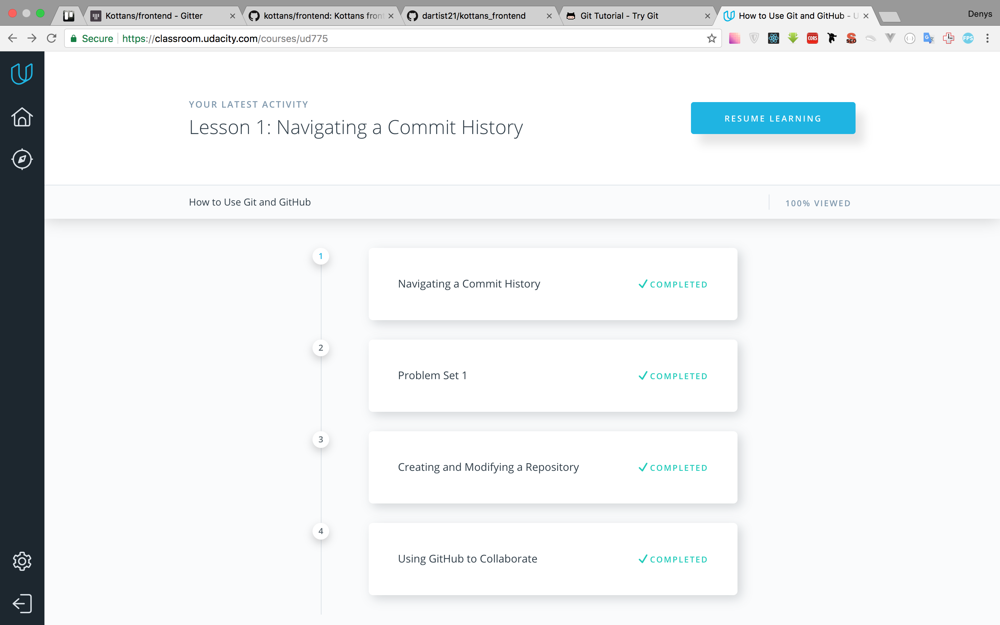
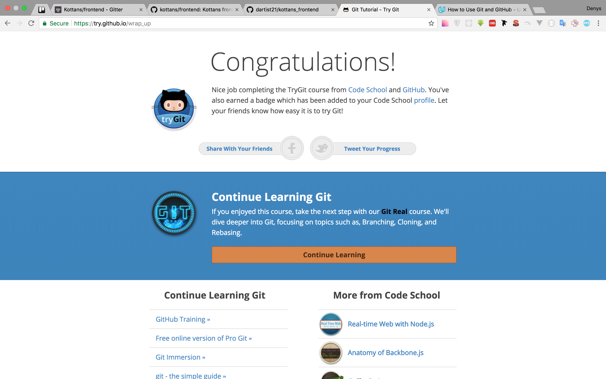

## Task 0 (get familiar with Git and GitHub):

Previously I was a bit familiar with git, but passing that courses on Udacity
and Codeschool helped me to restore my knowledge and clarify some unclear
moments. It was a great to refresh and organize my knowledge about git again.
Udacity course especially helped me to understand the git command `diff`.

I realized that I haven't used all the possibilities of git and github before.
So I am definitely going to try all learned knowledge in practice in near
future.

Thanks for this experience!

